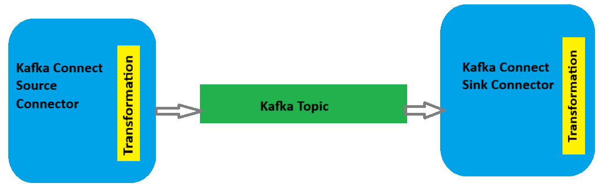
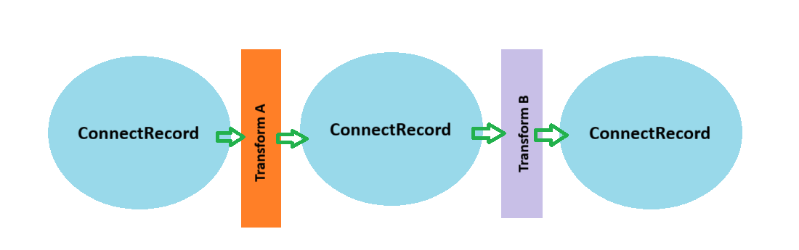

# Single Message Transforms
Kafka Single Message Transforms (SMTs) provide a way to perform lightweight record-level transformations on messages as they flow through Kafka Connect.
SMTs transform inbound messages after a source connector has produced them, but before they are written to a Kafka topic. SMTs transform outbound messages before they are sent to a sink connector.



## Quick Start

To get started with either a TxEventQ Sink Connector or TxEventQ Source Connector:

1. **Complete installation and setup**: Follow the [Installation and Setup Guide](README.md#installation-and-setup-guide-for-oracle-txeventq-jms-connectors) to install the connector and set up Oracle Database
2. **Configure the connector**: Create a configuration file with connection details requried for either a sink or source connector and add the additional transformation configuration (see [Configuring Kafka Connect Single Message Transforms](#configuring-kafka-connect-single-message-transforms))
3. **Start the connector**: Run in standalone or distributed mode

### Configuring Kafka Connect Single Message Transforms
Transforms are given a name, and that name is used to specify any further properties that the transformation requires. The TxEventQ Connector has a custom single message transform that takes a specified header value and makes the header value the new key value. The table below describes SMT.

| Property Name                        | Type             | Importance | Description|
|--------------------------------------|------------------|------------|------------|
|set.header.to.key                     |string            |high        |Specify the header name to take the value for and use as the new record key value.

Example of what needs to go into the [config/connect-txeventq-source.properties](config/connect-txeventq-source.properties) or [config/connect-txeventq-sink.properties](config/connect-txeventq-sink.properties) when running the connectors in Standalone Mode. If the SMT shown below is desired copy the properties below and place into the appropriate connector configuration properties file.

```text
	# The value set here can be changed to a different name, but that name will have to be updated in other parts of the configuration.
	# This property is used to list the names of the SMTs you want to apply. If you're using multiple SMTs, list them in the order they
	# should be applied, separated by commas.
	transforms= headerToKey
	
	# This specifies the fully qualified class name for the SMT.
	transforms.headerToKey.type=oracle.jdbc.txeventq.kafka.connect.transforms.HeaderToKey
	
	# The property value used by the SMT HeaderToKey that indicates which header value to use as the new record key value.
	transforms.headerToKey.set.header.to.key=id	
```

Example of what needs to go into the [config/txeventQ-source.json](config/txeventQ-source.json) or [config/txeventQ-sink.json](config/txeventQ-sink.json) when running the connectors in Distributed Mode. If the SMT shown below is desired copy the properties below and place into the appropriate connector configuration JSON file.

```text
	"transforms" : "headerToKey",
	"transforms.headerToKey.type" : "oracle.jdbc.txeventq.kafka.connect.transforms.HeaderToKey",
	"transforms.headerToKey.set.header.to.key" : "id"
```
Kafka ships with a number of [prebuilt transformation](https://kafka.apache.org/documentation/#connect_included_transformation) that could possibly be used with the TxEventQ connectors.

A custom SMT that can read JSON data that is in either string or byte form and parse the data to a connect structure based on the JSON schema provided can be installed and used with the connector by looking [here](https://jcustenborder.github.io/kafka-connect-documentation/projects/kafka-connect-json-schema/transformations/FromJson.html). If using this custom SMT install the jar file and set the `plugin.path` for this transformer.

### Performing Multiple Transformations
There will be times when more than one transformation is required. As a result of this Kafka Connect supports defining multiple transformations that are chained together in the configuration. These messages move through the transformations in the same order as they are defined in the transforms property.



The example below will show the configuration property with chained transformation when running the connectors in Distributed Mode. 

```text
	"transforms" : "fromJson, createKey, extractKey",
	"transforms.fromJson.type" : "com.github.jcustenborder.kafka.connect.json.FromJson$Value",
	"transforms.fromJson.json.schema.location" : "Inline",
	"transforms.fromJson.json.schema.inline" : "{\n \"properties\": {\n    \"firstName\": {\n      \"type\": \"string\",\n      \"description\": \"The person's first name.\"\n    },\n    \"lastName\": {\n      \"type\": \"string\",\n      \"description\": \"The person's last name.\"\n    },\n    \"Message Number\": {\n      \"description\": \"Random number.\",\n      \"type\": \"string\",\n  },\n    \"Job Skills\": {\n      \"type\": \"string\"\n    }\n  }\n}",
	"transforms.createKey.type" : "org.apache.kafka.connect.transforms.ValueToKey",
	"transforms.createKey.fields" : "Job Skills",
	"transforms.extractKey.type" : "org.apache.kafka.connect.transforms.ExtractField$Key",
	"transforms.extractKey.field" : "Job Skills"
```